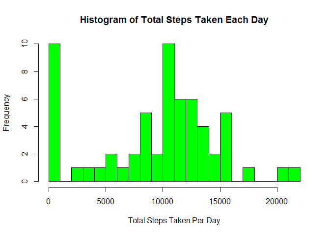
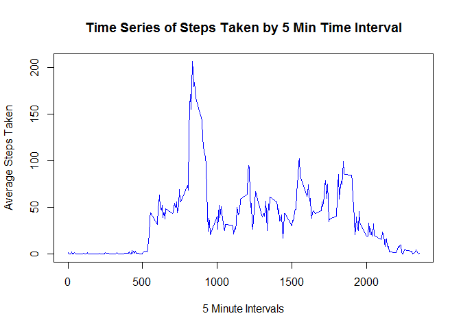
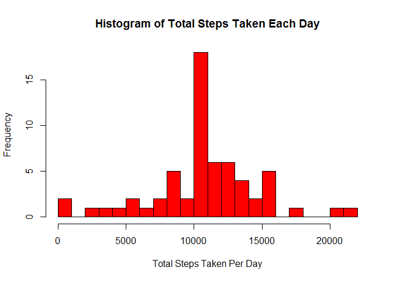
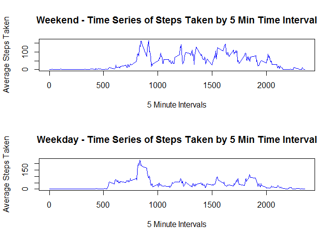

# Reproducible Research: Course Project 1

## Loading and preprocessing the data

```r
dataset <- read.csv("activity.csv", colClasses = c("integer", "character", "integer"))
dataset$date <- as.Date(dataset$date)
```

## What is mean total number of steps taken per day?

```r
totalsteps <- tapply(dataset$steps, dataset$date, sum, na.rm=TRUE)
steps <- as.vector(unlist(totalsteps))
dates <- unique(dataset$date)
totalstepsbyday <- data.frame(dates,steps)
hist(totalstepsbyday$steps, breaks = 20, main = "Histogram of Total Steps Taken Each Day", xlab = "Total Steps Taken Per Day", col = "green")
```



Mean of Total Number of Steps Taken Per Day = 

```r
print(mean(totalstepsbyday$steps))
```

```
## [1] 9354.23
```

Median of Total Number of Steps Taken Per Day = 

```r
print(median(totalstepsbyday$steps))
```

```
## [1] 10395
```

## What is the average daily activity pattern?

```r
stepsbyinterval <- tapply(dataset$steps, dataset$interval, mean, na.rm=TRUE)
stepsperintervalvector <- as.vector(unlist(stepsbyinterval))
intervals <- unique(dataset$interval)
avgstepsbyinterval <- data.frame(intervals,stepsperintervalvector)
plot(avgstepsbyinterval$intervals, avgstepsbyinterval$stepsperintervalvector, type = "l", col = "blue", main = "Time Series of Steps Taken by 5 Min Time Interval", xlab =  "5 Minute Intervals", ylab = "Average Steps Taken")
```



5 Minute Interval with most number of steps taken (average across all days) = 

```r
max <- subset(avgstepsbyinterval, avgstepsbyinterval$stepsperintervalvector == max(avgstepsbyinterval$stepsperintervalvector))
print(max$intervals)
```

```
## [1] 835
```

## Imputing missing values
Number of missing values in dataset =

```r
nrow(subset(dataset, is.na(steps)))
```

```
## [1] 2304
```

Strategy adopted to replace NAs:
Replace NAs with the mean of steps for the same 5 minute interval across all days

The following code is used to create the new dataset with the NAs replaced:

```r
for (i in seq_len(nrow(dataset))) {
  if(is.na(dataset[i,1])==TRUE) {
    dataset[i,1] <- subset(avgstepsbyinterval,avgstepsbyinterval$intervals == dataset[i,3])$stepsperintervalvector
    }
}
```

The following code is used to create the new histogram after the NAs are replaced:

```r
totalsteps <- tapply(dataset$steps, dataset$date, sum, na.rm=TRUE)
steps <- as.vector(unlist(totalsteps))
dates <- unique(dataset$date)
totalstepsbyday <- data.frame(dates,steps)
hist(totalstepsbyday$steps, breaks = 20, main = "Histogram of Total Steps Taken Each Day", xlab = "Total Steps Taken Per Day", col = "red")
```



New Mean of Total Number of Steps Taken Per Day = 

```r
print(mean(totalstepsbyday$steps))
```

```
## [1] 10766.19
```

New Median of Total Number of Steps Taken Per Day = 

```r
print(median(totalstepsbyday$steps))
```

```
## [1] 10766.19
```

Conclusion: Comparing the histogram/mean/median after NAs have been replaced, it is noted that both the mean and median have increased after NAs were replaced. 

## Are there differences in activity patterns between weekdays and weekends?
The following code is used to split the datasets into 2 data sets based on Weekdays and Weekends:

```r
dataset$day <- weekdays(dataset[,2])
dataset_wday <- subset(dataset, dataset$day %in% c("Monday", "Tuesday", "Wednesday", "Thursday", "Friday"))
dataset_wend <- subset(dataset, dataset$day %in% c("Saturday", "Sunday"))
```

The following code is used to create the panel plots for Weekends vs Weekdays:

```r
stepsbyinterval_wday <- tapply(dataset_wday$steps, dataset_wday$interval, mean)
stepsperintervalvector_wday <- as.vector(unlist(stepsbyinterval_wday))
intervals_wday <- unique(dataset_wday$interval)
avgstepsbyinterval_wday <- data.frame(intervals_wday,stepsperintervalvector_wday)

stepsbyinterval_wend <- tapply(dataset_wend$steps, dataset_wend$interval, mean)
stepsperintervalvector_wend <- as.vector(unlist(stepsbyinterval_wend))
intervals_wend <- unique(dataset_wend$interval)
avgstepsbyinterval_wend <- data.frame(intervals_wend,stepsperintervalvector_wend)

par(mfcol = c(2,1))
plot(avgstepsbyinterval_wend$intervals, avgstepsbyinterval_wend$stepsperintervalvector, type = "l", col = "blue", main = "Weekend - Time Series of Steps Taken by 5 Min Time Interval", xlab =  "5 Minute Intervals", ylab = "Average Steps Taken")
plot(avgstepsbyinterval_wday$intervals, avgstepsbyinterval_wday$stepsperintervalvector, type = "l", col = "blue", main = "Weekday - Time Series of Steps Taken by 5 Min Time Interval", xlab =  "5 Minute Intervals", ylab = "Average Steps Taken")
```



